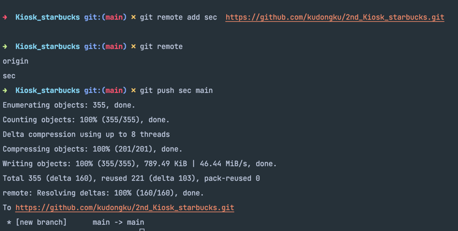
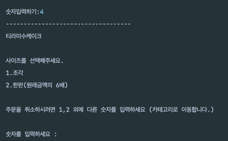

# Kiosk_starbucks
스타벅스의 키오스크를 재현

## 구현지침
- 출력은 System.out.println() 을 이용한다.
- 메뉴 클래스와 주문 클래스를 사용하여 Java 의 핵심 기능인 상속을 최대한 사용
- 메뉴는 3개 이상 (9개 우선 구현, 카테고리별로 3개씩 총 3개의 카테고리)
- 메뉴 클래스는 이름, 설명 필드를 가지는 클래스
- 상품 클래스는 이름 가격 설명 필드를 가지는 클래스
- 상품 클래스는 메뉴 클래스로부터 이름과 설명을 상속받는다. 
- 주문 클래스는 상품 객체를 담는다. 

## 구현 순서 목록
1. 메뉴와 상품, 주문 클래스 생성하기
2. 메뉴 클래스에 이름, 설명 필드 생성하기
3. 상품 클래스 메뉴 클래스 상속받기
4. 상품 클래스에 가격과 카테고리 추가하기
5. 주문 클래스에 상품 클래스 리스트 만들기
6. 메뉴판에서 카테고리 출력하기

## 구현과정
1. 깃헙에 레포지토리 생성
    1. 
2. 데스크탑에 git clone하기
   1. 
3. 리드미에 구현지침 작성하기
4. 구현지침을 보고 구현 순서 목록 작성하기
5. 초안으로 구현하기
   1. 클래스들 구현완료
   2. 클래스들에게 필드 구현 완료
   3. 메인에서 order 출력하기 메소드 구현완료
   4. 음료 3개 정도 만들어서 해보기
6. 구현 완료하기
7. 선택 요구사항 추가로 구현하기
   1. 주문 개수 기능 추가
   2. 상품 옵셕 기능 추가 (tall, grande, venti, 금액도 달라져야함)
   3. 총 판매금액 조회 기능 추가