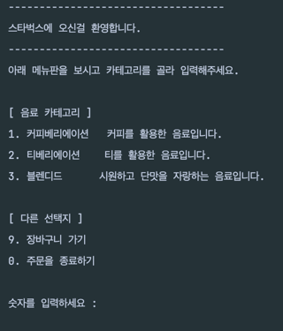
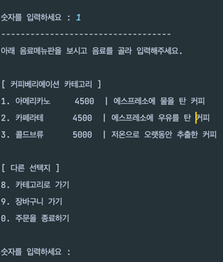
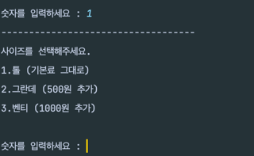
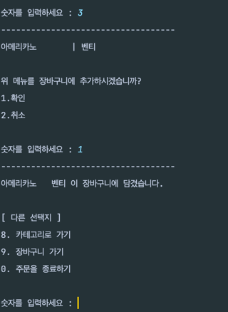
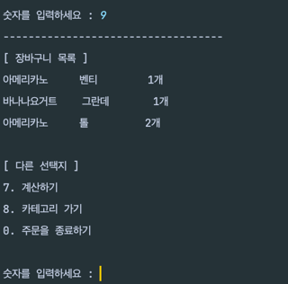
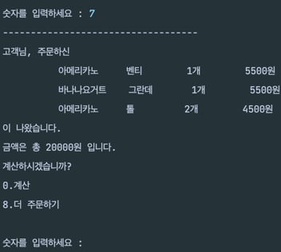
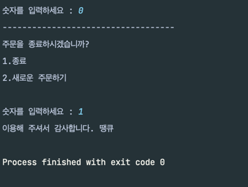
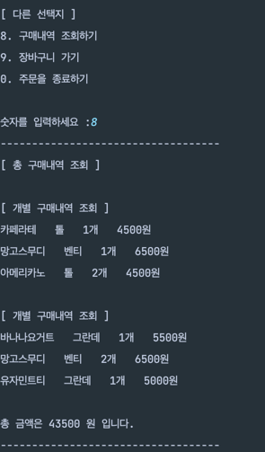
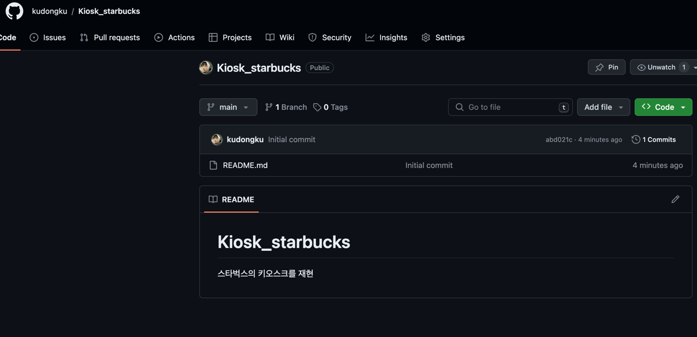
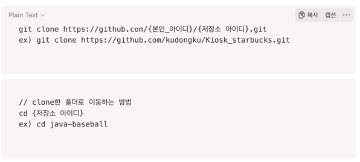

# Kiosk_starbucks
## 어떤 것을 더 구현해야 하는가
> 1. menu 를 상속받는 cake 카테고리 만들기
> 2. 객체 필드 모두 private 으로 처리하기
# 구현은 어디까지 되었는가
> 1. 주문하기
>    1. Main을 실행하시면, 음료 카테고리가 출력되며 선택을 하실 수 있습니다.
>    2. 음료 카테고리를 입력하시면, 해당 카테고리의 음료들이 출력됩니다.
>    3. 음료 번호를 입력하시면, 음료의 사이즈를 선택하실 수 있습니다.
>    4. 음료 사이즈를 선택하시면, 사이즈까지 장바구니에 담깁니다.
> 2. 장바구니에 들어가셔서 결제가 가능하십니다.
>    1. 장바구니에 들어가면 장바구니 리스트가 출력됩니다.
>    2. 장ㅇ바구니에 똑같은 상품이 담긴다면, 상품의 개수가 출력됩니다.
>    3. 결제하기를 입력하시면, 금액이 출력됩니다.
>    4. 결제를 하시면 종료할 것인지, 새롭게 주문할 건지 선택할 수 있습니다.
> 3. 새롭게 구매하신다면 총 구매목록을 조회할 수 있습니다.
>    1. 총 구매목록과 개별구매 목록이 출력됩니다.
>    2. 예를들어, 구매를 2번하시고 새롭게 주문하신 경우 개별구매 목록이 2개 뜨는 것을 확인할 수 있습니다.
>    3. 출력의 마지막에는 총 판매금액이 출력됩니다.
## 구현 결과















## 구현과정
1. 깃헙에 레포지토리 생성
    1. 
2. 데스크탑에 git clone하기
   1. 
3. 리드미에 구현지침 작성하기
4. 구현지침을 보고 구현 순서 목록 작성하기
5. 초안으로 구현하기
   1. 클래스들 구현완료
   2. 클래스들에게 필드 구현 완료
   3. 메인에서 order 출력하기 메소드 구현완료
   4. 음료 3개 정도 만들어서 해보기
6. 구현 완료하기
7. 선택 요구사항 추가로 구현하기
   1. 주문 개수 기능 추가
   2. 상품 옵셕 기능 추가 (tall, grande, venti, 금액도 달라져야함)
   3. 총 판매금액 조회 기능 추적


## 구현지침

<aside>
📢 내가 좋아하는 카페 또는 패스트푸드점의 **키오스크**를 만들어보자!

- 지금까지 배워온 Java 언어를 사용하여 키오스크 프로그램을 만들어봅시다.
- 내가 좋아하는 카페나 패스트푸드점의 메뉴판 데이터를 사용하면 더 재밌겠죠?
</aside>

> 1. 메뉴판을 보고 주문할 수 있는 Java 프로그램
2. 화면은 `System.out.println()` 메소드를 사용해서 심플하게 출력한다.
3. `메뉴 클래스`와 `주문 클래스`를 사용하여 Java 의 핵심 기능인 **상속**을 최대한 사용
4. 내가 좋아하는 메뉴들로 다양하게 구성해보세요!

## ☕ 과제 요구사항 및 출력 예시

---

- 필수 요구사항

  > **Java 클래스 설계 시 필수 요구사항!**
  >
  > - 메뉴 클래스는 이름, 설명 필드를 가지는 클래스로 만들어주세요.
  > - 상품 클래스는 이름, 가격, 설명 필드를 가지는 클래스로 만들어주세요.
  > - 상품 클래스의 이름, 설명 필드는 메뉴 클래스를 상속받아 사용하는 구조로 개발해주세요.
  > - 주문 클래스도 만들어서 상품 객체를 담을 수 있도록 해주세요.
   1. 메인 메뉴판 화면
      - 메인 메뉴판이 출력되며 메뉴판에는 상품 메뉴가 출력 됩니다.
      - 상품 메뉴는 간단한 설명과 함께 출력 되며 최소 3개 이상 출력 됩니다.
      - 상품 메뉴 아래에는 Order(주문)와 Cancel(주문 취소) 옵션을 출력해줍니다.

       ```
       "SHAKESHACK BURGER 에 오신걸 환영합니다."
       아래 메뉴판을 보시고 메뉴를 골라 입력해주세요.
       
       [ SHAKESHACK MENU ]
       1. Burgers         | 앵거스 비프 통살을 다져만든 버거
       2. Forzen Custard  | 매장에서 신선하게 만드는 아이스크림
       3. Drinks          | 매장에서 직접 만드는 음료
       4. Beer            | 뉴욕 브루클린 브루어리에서 양조한 맥주
       
       [ ORDER MENU ]
       5. Order       | 장바구니를 확인 후 주문합니다.
       6. Cancel      | 진행중인 주문을 취소합니다.
       ```

   2. 상품 메뉴판 화면
      - 상품 메뉴 선택 시 해당 카테고리의 메뉴판이 출력됩니다.
      - 메뉴판에는 각 메뉴의 이름과 가격과 간단한 설명이 표시됩니다.

       ```
        "SHAKESHACK BURGER 에 오신걸 환영합니다."
       아래 상품메뉴판을 보시고 상품을 골라 입력해주세요.
       
       [ Burgers MENU ]
       1. ShackBurger   | W 6.9 | 토마토, 양상추, 쉑소스가 토핑된 치즈버거
       2. SmokeShack    | W 8.9 | 베이컨, 체리 페퍼에 쉑소스가 토핑된 치즈버거
       3. Shroom Burger | W 9.4 | 몬스터 치즈와 체다 치즈로 속을 채운 베지테리안 버거
       3. Cheeseburger  | W 6.9 | 포테이토 번과 비프패티, 치즈가 토핑된 치즈버거
       4. Hamburger     | W 5.4 | 비프패티를 기반으로 야채가 들어간 기본버거
       ```

   3. 구매 화면
      - 상품 선택 시 해당 상품을 장바구니에 추가할지 확인하는 문구가 출력 됩니다.
      - `1.확인` 입력 시 장바구니에 추가되었다는 안내 문구와 함께 메인 메뉴로 다시 출력 됩니다.

       ```
       "Hamburger     | W 5.4 | 비프패티를 기반으로 야채가 들어간 기본버거"
       위 메뉴를 장바구니에 추가하시겠습니까?
       1. 확인        2. 취소
       ```

       ```
       Hamburger 가 장바구니에 추가되었습니다.
       
       "SHAKESHACK BURGER 에 오신걸 환영합니다."
       아래 메뉴판을 보시고 메뉴를 골라 입력해주세요.
       
       [ SHAKESHACK MENU ]
       1. Burgers         | 앵거스 비프 통살을 다져만든 버거
       2. Forzen Custard  | 매장에서 신선하게 만드는 아이스크림
       3. Drinks          | 매장에서 직접 만드는 음료
       4. Beer            | 뉴욕 브루클린 브루어리에서 양조한 맥주
       
       [ ORDER MENU ]
       5. Order       | 장바구니를 확인 후 주문합니다.
       6. Cancel      | 진행중인 주문을 취소합니다.
       ```

   4. 주문 화면
      - `5.Order` 입력 시 장바구니 목록을 출력해줍니다.
      - 장바구니에서는 추가된 메뉴들과 총 가격의 합을 출력해줍니다.
      - `1.주문` 입력 시 주문완료 화면으로 넘어가고, `2.메뉴판` 입력 시 다시 메인 메뉴로 돌아옵니다.

       ```
       아래와 같이 주문 하시겠습니까?
       
       [ Orders ]
       ShackBurger   | W 6.9 | 토마토, 양상추, 쉑소스가 토핑된 치즈버거
       SmokeShack    | W 8.9 | 베이컨, 체리 페퍼에 쉑소스가 토핑된 치즈버거
       
       [ Total ]
       W 15.8
       
       1. 주문      2. 메뉴판
       ```

   5. 주문완료 화면
      - `1.주문` 입력 시 대기번호를 발급해줍니다.
      - 장바구니는 초기화되고 3초 후에 메인 메뉴판으로 돌아갑니다.

       ```
       주문이 완료되었습니다!
       
       대기번호는 [ 1 ] 번 입니다.
       (3초후 메뉴판으로 돌아갑니다.)
       ```

       ```
       "SHAKESHACK BURGER 에 오신걸 환영합니다."
       아래 메뉴판을 보시고 메뉴를 골라 입력해주세요.
       
       [ SHAKESHACK MENU ]
       1. Burgers         | 앵거스 비프 통살을 다져만든 버거
       2. Forzen Custard  | 매장에서 신선하게 만드는 아이스크림
       3. Drinks          | 매장에서 직접 만드는 음료
       4. Beer            | 뉴욕 브루클린 브루어리에서 양조한 맥주
       
       [ ORDER MENU ]
       5. Order       | 장바구니를 확인 후 주문합니다.
       6. Cancel      | 진행중인 주문을 취소합니다.
       ```

   6. 주문 취소 화면
      - 메뉴판에서 `6.Cancel` 입력시 주문을 취소할지 확인을 요청하는 문구가 출력 됩니다.
      - `1.확인` 을 입력하면 장바구니는 초기화되고 취소 완료 문구와 함께 메뉴판이 출력 됩니다.

       ```
       진행하던 주문을 취소하시겠습니까?
       1. 확인        2. 취소
       ```

       ```
       진행하던 주문이 취소되었습니다.
       
       "SHAKESHACK BURGER 에 오신걸 환영합니다."
       아래 메뉴판을 보시고 메뉴를 골라 입력해주세요.
       
       [ SHAKESHACK MENU ]
       1. Burgers         | 앵거스 비프 통살을 다져만든 버거
       2. Forzen Custard  | 매장에서 신선하게 만드는 아이스크림
       3. Drinks          | 매장에서 직접 만드는 음료
       4. Beer            | 뉴욕 브루클린 브루어리에서 양조한 맥주
       
       [ ORDER MENU ]
       5. Order       | 장바구니를 확인 후 주문합니다.
       6. Cancel      | 진행중인 주문을 취소합니다.
       ```


- 선택 요구사항
   1. 주문 개수 기능 추가
      - 장바구니에 똑같은 상품이 담기면 주문 화면에서 상품 개수가 출력 되도록 합니다.

       ```
       아래와 같이 주문 하시겠습니까?
       
       [ Orders ]
       ShackBurger   | W 6.9 | 2개 | 토마토, 양상추, 쉑소스가 토핑된 치즈버거
       SmokeShack    | W 8.9 | 1개 | 베이컨, 체리 페퍼에 쉑소스가 토핑된 치즈버거
       
       [ Total ]
       W 15.8
       
       1. 주문      2. 메뉴판
       ```

   2. 상품 옵션 기능 추가
      - 상품에 옵션을 선택 후 장바구니에 추가 할 수 있게 세분화 합니다.

       ```
       "Hamburger     | W 5.4 | 비프패티를 기반으로 야채가 들어간 기본버거"
       위 메뉴의 어떤 옵션으로 추가하시겠습니까?
       1. Single(W 5.4)        2. Double(W 9.0)
       ```

       ```
       "Hamburger(Double) | W 9.0 | 비프패티를 기반으로 야채가 들어간 기본버거"
       위 메뉴를 장바구니에 추가하시겠습니까?
       1. 확인        2. 취소
       ```

   3. 총 판매금액 조회 기능 추가
      - 구매가 완료될 때마다 총 판매 금액을 누적해줍니다.
      - 숨겨진 기능으로 0번 입력 시 총 판매금액을 출력합니다.

       ```
       [ 총 판매금액 현황 ]
       현재까지 총 판매된 금액은 [ W 102.4 ] 입니다.
       
       1. 돌아가기
       ```

   4. 총 판매상품 목록 조회 기능 추가
      - 구매가 완료될 때마다 판매 상품 목록을 저장해줍니다.
      - 숨겨진 기능으로 0번 입력 시 총 판매 상품 목록을 출력합니다.

       ```
       [ 총 판매상품 목록 현황 ]
       현재까지 총 판매된 상품 목록은 아래와 같습니다.
       
       - ShackBurger    | W 6.9
       - Float          | W 2.9
       - SmokeShack     | W 8.9
       - Shroom Burger  | W 9.4
       - Fountain Sodar | W 2.7
       - Cheeseburger   | W 6.9
       - SmokeShack     | W 8.9
       - Shroom Burger  | W 9.4
       - Cheeseburger   | W 6.9
       
       1. 돌아가기
       ```


<aside>
💡 자바 기초만 배우다가, 해당 과제를 보니 조금 어려우신가요?

</aside>

1. 먼저, 과제의 큰 그림을 그려봅시다.  
   (피자가게 : 메뉴 → 사이드 → 음료 순으로 고른다 > 결제 > 주문이 완료되었습니다. )
2. 그 그림을 바탕으로 코드를 작성해봅시다.
3. 깃허브 리포지토리를 생성한 후 과제를 커밋, 푸시 합니다.
4. 구글폼을 통해 과제를 제출합니다. `(제출 링크는 추후 공지 예정)`
5. 제출한 과제의 코드를 튜터님과 공유하여 피드백을 얻어봅니다.
6. 팀원들과 함께 과제 코드 리뷰를 해봅시다.
   1. 코드 공유를 두려워하지 마세요!
      ‘나는 못했어요.’ 라는 말 금지! 무조건 설명하고, 무조건 답 얻어가기!
   2. 코드 공유를 불필요하다고 생각하지 말아주세요.
      ’내가 설명해줘도 팀원은 이해 못 할거야. 코드 리뷰 안 해!’ 라는 생각 금지!
      여러분의 코드를 다른 사람들에게 설명하는 습관은 정말 중요합니다.
7. 튜터님의 피드백과 팀원들과의 코드 리뷰를 바탕으로 나의 코드를 보완해봅니다.